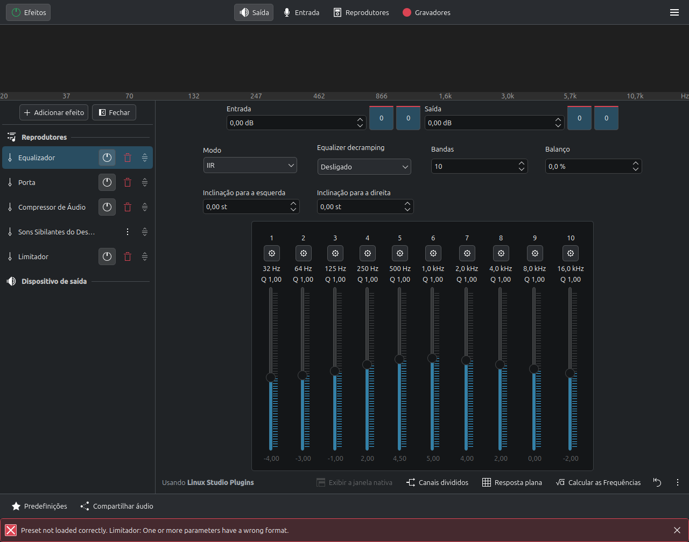
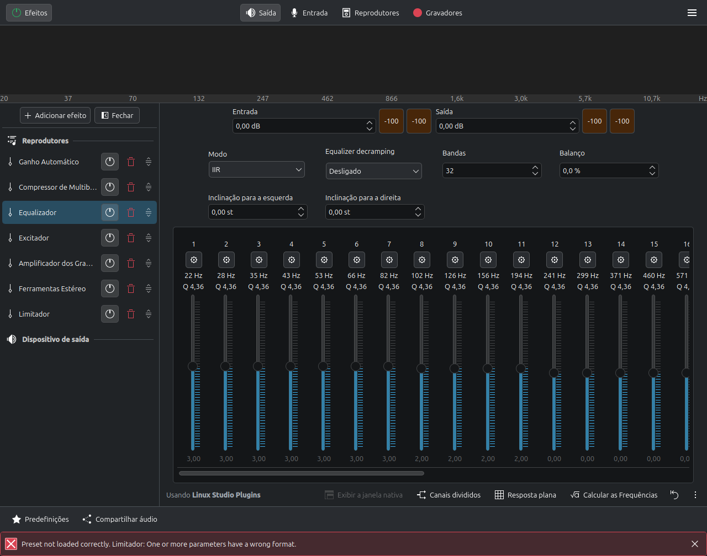

# EasyEffects Audio Platform

[](LICENSE)
[](https://github.com/edevsiv/easyeffects-presets/stargazers)
[](https://github.com/edevsiv/easyeffects-presets/releases)
[](https://github.com/edevsiv/easyeffects-presets/issues)
[](https://github.com/edevsiv/easyeffects-presets/pulls)
[](https://github.com/edevsiv/easyeffects-presets)
[](https://github.com/wwmm/easyeffects)
[](https://pipewire.org/)
[](https://github.com/edevsiv/easyeffects-presets/actions/workflows/validate-json.yml)

Open **Linux audio engineering & calibration platform** for [EasyEffects](https://github.com/wwmm/easyeffects) + [PipeWire](https://pipewire.org/) — knowledge, research, hardware scorecards, certified profiles, and tools. Shipping presets are one artifact of the platform, not the whole product.

**Mission:** help any Linux audio user understand hardware → calibrate → choose a profile → optionally correct with AutoEQ/Convolver → contribute evidence.

| Enter here | Path |
|------------|------|
| Platform hub | [platform/](platform/) |
| Profile database | [platform/audio-profiles/](platform/audio-profiles/) · [profiles.json](platform/database/profiles.json) |
| Hardware taxonomy | [platform/hardware/](platform/hardware/) |
| DSP knowledge base | [platform/dsp/](platform/dsp/) |
| Recommend by hardware | [platform/tools/recommend-by-hardware.md](platform/tools/recommend-by-hardware.md) |
| Governance / releases | [platform/GOVERNANCE.md](platform/GOVERNANCE.md) · [RELEASE_STRATEGY.md](platform/RELEASE_STRATEGY.md) |
| Future website IA | [docs/site/](docs/site/) |


## Validation status

| Item | Status |
|------|--------|
| Dashboard | [validation/dashboard.md](validation/dashboard.md) |
| Certification criteria | [validation/CERTIFICATION.md](validation/CERTIFICATION.md) |
| UI campaign | [VC-2026-08](validation/CAMPAIGN_VC-2026-08.md) — complete (screenshots + ui-load) |
| Listening campaign | [VC-2026-08-LISTEN](validation/campaigns/VC-2026-08-LISTEN/) — **open · 0 sessions** |
| Reference hardware | [HW-001 Acer Nitro AN515-51](validation/hardware/HW-001-acer-nitro-an515-51.md) (Realtek ALC255) |
| Seals | **10 Beta · 1 Experimental · 0 Validated · 0 Stable** — [STATUS.md](validation/STATUS.md) |
| Profile dossiers | [validation/profiles/](validation/profiles/) |
| Stable release | **Blocked** until Validated gates (listening forms) |

## Reference hardware

| ID | Device | Role |
|----|--------|------|
| HW-001 | Acer Nitro AN515-51 · Realtek ALC255 · PipeWire 1.0.5 · EasyEffects Flatpak 8.2.8 | P0 reference (UI + pending listening) |

Categories: notebook, desktop, USB DAC, headphones, gaming, Bluetooth, speakers 2.0 / 2.1 — see [validation/hardware/](validation/hardware/).

Reproducibility pack: [validation/reproducibility/](validation/reproducibility/).

## Listening campaign

Official subjective program (FASE 05):

| Resource | Path |
|----------|------|
| Protocol | [validation/forms/SESSION_PROTOCOL.md](validation/forms/SESSION_PROTOCOL.md) |
| Questionnaire | [validation/forms/LISTENING_FORM.md](validation/forms/LISTENING_FORM.md) |
| Campaign | [VC-2026-08-LISTEN](validation/campaigns/VC-2026-08-LISTEN/) |
| Listeners | [validation/listeners/](validation/listeners/) |

Scores: Voice Clarity, Bass, Treble, Stereo, Dynamic Range, Fatigue, Immersion, Naturalness, Overall + comments.

## Scientific validation

Promotion path (objective gates only):

`Experimental → Beta → Validated → Stable → Reference`

| Seal | Evidence bar (summary) |
|------|------------------------|
| Beta | Loads on reference HW + screenshots / ui-load |
| Validated | Listening form + A/B vs Flat + metric gates |
| Stable | Validated + release regression checklist |
| Reference | Multi-listener / multi-HW gold |

Full gates: [validation/CERTIFICATION.md](validation/CERTIFICATION.md). Engineering method: metrics → datasheets → UI evidence → listening → seals.

## Description

**EasyEffects Audio Platform** (repository name: *easyeffects-presets*) is an open engineering laboratory and calibration system for Linux desktop audio. It includes:

- A curated set of EasyEffects **output profiles** (JSON)
- **Hardware** taxonomy, scorecards, and calibration playbooks
- A **DSP knowledge base** (why/when/how — not only plugin knobs)
- **Research** mappings from commercial suites (FxSound, Dolby, DTS, Sonar, Peace, MaxxAudio, Nahimic, Realtek)
- **Certification** gates and listening campaigns
- **Tools** that recommend profiles and AutoEQ steps without silently rewriting chains

Start from your hardware in [platform/tools/recommend-by-hardware.md](platform/tools/recommend-by-hardware.md), not from a random preset list.

## Project philosophy

1. **Platform over pack** — knowledge and calibration outrank shipping more JSON.
2. **Open over opaque** — every chain is inspectable, not a closed driver knob.
3. **Honest approximations** — we map commercial *goals*, not bit-identical clones.
4. **Evidence before seals** — [CERTIFICATION](validation/CERTIFICATION.md) gates only.
5. **Linux-native** — PipeWire + EasyEffects first.
6. **Safety** — limiters on loud chains; fatigue is a first-class metric.

## Objectives

- Provide **knowledge, calibration, research, profiles, and tools** for Linux audio users
- Maintain auditable EasyEffects profiles with datasheets and history
- Grow hardware scorecards (Realtek, DAC, HDMI, BT, headphones, …)
- Keep a research lab and commercial feature matrix
- Document install, PipeWire, and MPV paths
- Enforce listening methodology and community process
- Evolve toward a documentation site ([docs/site/](docs/site/)) through **v5.0**

## Screenshots

Real EasyEffects **8.2.8** captures from validation campaign VC-2026-08:

| Category | Preview |
|----------|---------|
| Overview |  |
| Movie |  |
| Music |  |
| Gaming |  |
| Voice |  |
| Experimental |  |

Additional EQ/compressor views: [validation/screenshots/](validation/screenshots/).

Full catalog: [presets/README.md](presets/README.md)

## Features

- **Audio Platform** layer (`platform/`) — databases, DSP KB, tools, community, governance
- **11** output profiles across **5** categories (cards + `profiles.json` index)
- Hardware taxonomy (Realtek/ALC*, DAC, HDMI, BT, speakers, headphones, IEM, …) + scorecards
- Calibration playbooks + recommend-by-hardware search design
- Certification program + listening campaigns + seals (Beta/Experimental/…)
- Real EasyEffects screenshots and scientific datasheets
- Research lab vs commercial DSP suites
- AutoEQ recommendations + open IR catalog scores (no silent preset edits)
- Future website IA under `docs/site/`
- Installer, CI, PipeWire/MPV guides — MIT licensed

## Scientific methodology

Presets are engineered products, not vibe tweaks.

1. **Declare objective** and primary metrics ([measurements/METRICS.md](measurements/METRICS.md))
2. **Set parameters** with datasheet justification ([measurements/datasheets/](measurements/datasheets/))
3. **design-audit** scorecard against category weights
4. **UI-load / screenshot evidence** on registered hardware ([validation/](validation/))
5. **Listening form** + A/B vs Flat ([validation/forms/](validation/forms/))
6. **Assign seal** only when [CERTIFICATION](validation/CERTIFICATION.md) gates pass

Calibration playbooks: [calibration/](calibration/).

## Methodology & research

| Resource | Description |
|----------|-------------|
| [platform/](platform/) | Audio Platform hub (databases, DSP KB, tools, governance) |
| [docs/site/](docs/site/) | Future documentation website IA |
| [research/](research/) | DSP research lab & commercial suite notes |
| [research/FEATURE_MATRIX.md](research/FEATURE_MATRIX.md) | Capability matrix → EasyEffects equivalents |
| [research/fxsound/MAPPING.md](research/fxsound/MAPPING.md) | FxSound knob → EasyEffects map |
| [docs/audio-engine/](docs/audio-engine/) | Plugin engineering handbook |
| [docs/methodology/TEST_PROTOCOL.md](docs/methodology/TEST_PROTOCOL.md) | Official preset validation protocol |
| [docs/methodology/AB_TESTING.md](docs/methodology/AB_TESTING.md) | Official A/B protocol |
| [measurements/](measurements/) | Metrics, datasheets, hardware, logs |
| [validation/](validation/) | Certification lab, seals, screenshots, results |
| [validation/CERTIFICATION.md](validation/CERTIFICATION.md) | Promotion gates (Beta → Reference) |
| [validation/dashboard.md](validation/dashboard.md) | Certification dashboard |
| [validation/campaigns/](validation/campaigns/) | Listening campaigns |
| [calibration/](calibration/) | Device-class calibration playbooks |
| [autoeq/ARCHITECTURE.md](autoeq/ARCHITECTURE.md) | AutoEQ integration design |
| [autoeq/recommend.py](autoeq/recommend.py) | Experimental recommendation generator |
| [impulse-responses/OFFICIAL_IR.md](impulse-responses/OFFICIAL_IR.md) | First official IR candidate |
| [impulse-responses/SELECTION.md](impulse-responses/SELECTION.md) | Open IR selection checklist |
| [references/](references/) | Reference films, music, speech, games |
| [benchmark/](benchmark/) | Comparative benchmark scorecard |
| [presets/HISTORY.md](presets/HISTORY.md) | Per-preset objectives & change ledger |
| [release/CHECKLIST_v1.0.0.md](release/CHECKLIST_v1.0.0.md) | v1.0.0 checklist |
| [release/NOTES_v1.0.0-rc1.md](release/NOTES_v1.0.0-rc1.md) | RC1 release notes |
| [AUDIO_ROADMAP.md](AUDIO_ROADMAP.md) | Technical roadmap through **v3.0** |


## Architecture of presets

```text
Commercial research  →  Chain archetype  →  EasyEffects JSON  →  Test protocol  →  Measurement log  →  Release
```

Heavy cinema / enhancer archetype (example):

`Autogain → Multiband Compressor → Equalizer → Exciter → Bass Enhancer → Stereo Tools → Limiter`

See [docs/audio-engine/README.md](docs/audio-engine/README.md) for gain-staging rules.

## Quick install

```bash
git clone https://github.com/edevsiv/easyeffects-presets.git
cd easyeffects-presets
chmod +x scripts/install.sh
./scripts/install.sh
```

Then open EasyEffects → **Presets** and select one of the imported profiles.

Dry-run / force path:

```bash
./scripts/install.sh --dry-run
./scripts/install.sh --flatpak
./scripts/install.sh --native
```

## Importing presets (manual)

1. Install EasyEffects (see [docs/INSTALL.md](docs/INSTALL.md))
2. Copy JSON files into the output presets directory:

| Install method | Typical path |
|----------------|--------------|
| Native (newer) | `~/.local/share/easyeffects/output/` |
| Native (older) | `~/.config/easyeffects/output/` |
| Flatpak | `~/.var/app/com.github.wwmm.easyeffects/config/easyeffects/output/` |

3. Or use **Import Preset** in the EasyEffects UI

```bash
mkdir -p ~/.local/share/easyeffects/output
cp presets/*/*.json ~/.local/share/easyeffects/output/
```

## Project structure

```text
easyeffects-presets/
├── platform/            # Audio Platform (databases, DSP KB, tools, governance)
├── docs/site/           # Future website information architecture
├── validation/          # certification, campaigns, forms, evidence
├── calibration/         # device-class playbooks
├── measurements/        # metrics, datasheets, version-history
├── research/            # commercial DSP research
├── docs/                # install + audio-engine + methodology
├── autoeq/              # APO parser + recommend.py (no auto-edit)
├── impulse-responses/   # IR catalog + scores + OFFICIAL_IR
├── presets/             # categorized JSON artifacts + HISTORY
├── release/             # checklists, notes, dist ZIP
├── screenshots/         # PNG gallery (from validation)
├── scripts/
├── mpv/
└── pipewire/
```

## Requirements

- Linux with working audio
- **PipeWire** (+ WirePlumber recommended)
- **EasyEffects** 7.x or newer preferred
- LV2 plugins commonly used by EasyEffects (Equalizer, compressor, limiter, …)

## Required plugins

Most EasyEffects packages pull these in. If a preset fails to load a module, install distribution packages such as:

| Plugin family | Used for |
|---------------|----------|
| LSP / built-in EQ | Equalizer |
| EasyEffects built-ins | Bass Enhancer, Exciter, Stereo Tools, Autogain, Gate, De-esser |
| Multiband compressor | `*-02` cinematic / enhancer chains |
| Limiter / Maximizer | Peak protection |

Exact package names: `lsp-plugins`, `calf-plugins`, `zam-plugins` (distro-dependent). See [docs/INSTALL.md](docs/INSTALL.md).

## PipeWire

EasyEffects is a PipeWire filter client. Buffer (**quantum**), sample rate, and CPU headroom decide whether heavy presets crackle.

- Guide: [docs/PIPEWIRE.md](docs/PIPEWIRE.md)
- Example config: [pipewire/99-quantum-example.conf](pipewire/99-quantum-example.conf)

Starting point for desktop use: **48 kHz**, quantum **1024**.

## EasyEffects

- Project: https://github.com/wwmm/easyeffects
- Community presets wiki: https://github.com/wwmm/easyeffects/wiki/Community-Presets
- Enable the application you want to process (or process all outputs)
- Prefer a **limiter** at the end of loud chains (already included in this pack)

## Compatibility

| Component | Status |
|-----------|--------|
| PipeWire | Supported (recommended) |
| PulseAudio-only | Not targeted (EasyEffects is PipeWire-oriented) |
| EasyEffects 7+ | Primary target |
| EasyEffects Flatpak | Supported via `~/.var/app/...` paths |
| PulseEffects presets | Not supported without conversion |
| HDMI bitstream passthrough | Bypass EasyEffects (need PCM decode) |

## Preset overview

| Preset | Category | Use when… |
|--------|----------|-----------|
| `cinema-01` / `cinema-02` | movie | Films & series |
| `music-hd-01` / `music-hd-02` / `classic-music-01` | music | Music listening |
| `gaming-01` / `gaming-02` | gaming | Games |
| `voice-boost-01` / `voice-boost-02` | voice | Speech-heavy content |
| `volume-booster-01` / `fxsound-ultimate-02` | experimental | Loudness / enhancer fun |

Details and plugin lists: [presets/README.md](presets/README.md)

## FAQ

**Does this replace EasyEffects?**  
No. This repository only provides presets and docs.

**Can I use these with headphones and speakers?**  
Yes. Start with `*-01` profiles; tune EQ to your device.

**Why do some `*-02` presets look similar?**  
They share a fuller “premium” processing stack (autogain, multiband, exciter, …) with category-specific tuning in the JSON parameters.

**Is Flatpak supported?**  
Yes. Use `./scripts/install.sh --flatpak` or copy into the Flatpak config tree.

**Will this work on Steam Deck / immutable distros?**  
Yes if EasyEffects runs (often via Flatpak).

## Troubleshooting

| Problem | What to try |
|---------|-------------|
| Preset missing after copy | Wrong directory (Flatpak vs native); restart EasyEffects |
| No audible change | App not processed; wrong output device; bypass enabled |
| Crackling | Raise PipeWire quantum; use lighter `*-01` preset |
| Clipping / harshness | Lower Autogain / Bass Enhancer; rely on Limiter |
| Plugin missing | Install LSP/Calf/Zam packages; update EasyEffects |
| mpv + cinema sounds wrong | Avoid double loudness (see [docs/MPV.md](docs/MPV.md)) |

More: [docs/INSTALL.md](docs/INSTALL.md), [docs/PIPEWIRE.md](docs/PIPEWIRE.md)

## Roadmap

| Phase | Focus | Status |
|-------|-------|--------|
| FASE 01–03 | Scaffold, research, DSP engineering | Done |
| FASE 04 | UI validation + RC1 | Done |
| FASE 05 | Certification / listening program | Program live · sessions pending |
| FASE 06 | **Audio Platform** (this phase) | **Scaffolding done** |
| FASE 07 | Listening evidence → Validated → Stable v1.0.0 | Next |

Product track:

- [x] Platform architecture + profile/hardware databases
- [x] DSP knowledge base + community + governance
- [x] Website IA (`docs/site/`) + search design
- [ ] Listening sessions → **Validated** seals → **v1.0.0 Stable**
- [ ] Hardware search CLI · static site deploy
- [ ] Convolver workflow with license-cleared IR pack
- [ ] Input (mic) profiles · multi-HW Reference seals (v5)

**Roadmap through v5.0:** [AUDIO_ROADMAP.md](AUDIO_ROADMAP.md) · **RC1:** [release/NOTES_v1.0.0-rc1.md](release/NOTES_v1.0.0-rc1.md)

Track releases in [CHANGELOG.md](CHANGELOG.md).

## Credits

- [EasyEffects](https://github.com/wwmm/easyeffects) by Wellington Wallace and contributors
- [PipeWire](https://pipewire.org/) project
- Community preset authors listed on the [EasyEffects wiki](https://github.com/wwmm/easyeffects/wiki/Community-Presets)
- Research references: FxSound (open source), Dolby PC white papers, DTS Sound Unbound docs, SteelSeries Sonar, Equalizer APO / Peace, Waves MaxxAudio, Nahimic, Realtek Audio Console — all unaffiliated marks belong to their owners

## License

Distributed under the [MIT License](LICENSE).

## Contributing

Read [CONTRIBUTING.md](CONTRIBUTING.md) and follow the [Code of Conduct](CODE_OF_CONDUCT.md).

### How to propose preset improvements

1. Change JSON only with engineering rationale (not taste-only).
2. Update the preset [datasheet](measurements/datasheets/) and add `measurements/version-history/` entry.
3. Run A/B vs previous + Flat using [AB_TESTING.md](docs/methodology/AB_TESTING.md).
4. Attach scores for primary category metrics.
5. Pass local validation:

```bash
./scripts/validate.sh
python3 scripts/check_markdown_links.py
```

Security reports: [SECURITY.md](SECURITY.md)

---

### Topics (discovery / SEO)

`easyeffects` · `pipewire` · `linux` · `equalizer` · `audio` · `dolby` · `fxsound` · `preset` · `linux-audio` · `audio-processing`

Suggested GitHub repository topics:

```text
easyeffects pipewire linux equalizer audio dolby fxsound preset linux-audio audio-processing
```
