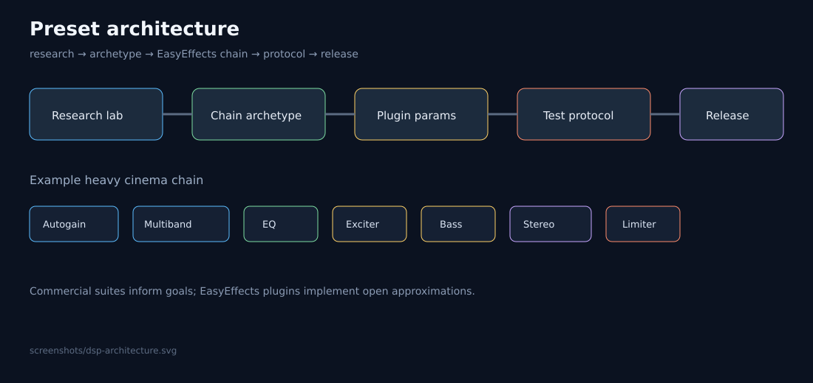

# EasyEffects Presets Premium

[](LICENSE)
[](https://github.com/edevsiv/easyeffects-presets/stargazers)
[](https://github.com/edevsiv/easyeffects-presets/releases)
[](https://github.com/edevsiv/easyeffects-presets/issues)
[](https://github.com/edevsiv/easyeffects-presets/pulls)
[](https://github.com/edevsiv/easyeffects-presets)
[](https://github.com/wwmm/easyeffects)
[](https://pipewire.org/)
[](https://github.com/edevsiv/easyeffects-presets/actions/workflows/validate-json.yml)

Curated, categorized **EasyEffects** output presets for **PipeWire** on Linux — cinema, music, gaming, voice, and experimental enhancer-style chains.


## Description

**EasyEffects Presets Premium** is an open-source collection of ready-to-import JSON presets for [EasyEffects](https://github.com/wwmm/easyeffects) — and a **PipeWire DSP research laboratory**. Beyond shipping presets, we reverse-map commercial audio suites (FxSound, Dolby, DTS, Sonar, Peace, MaxxAudio, Nahimic, Realtek) to open EasyEffects building blocks, with a documented test protocol.

Whether you want clearer film dialogue, punchier games, or an FxSound-like listening mode after moving from Windows, pick a category and import.

## Project philosophy

1. **Open over opaque** — every chain is inspectable JSON, not a closed driver knob.
2. **Honest approximations** — we map Dolby/FxSound/DTS *goals*, we do not claim bit-identical clones.
3. **Methodology before marketing** — presets change only after the [test protocol](docs/methodology/TEST_PROTOCOL.md).
4. **Linux-native** — PipeWire + EasyEffects first; Windows suites are research references.
5. **Safety** — loud enhancers end with limiters; fatigue matters as much as “wow”.

## Objectives

- Ship **production-ready** EasyEffects presets with consistent naming
- Maintain a **research lab** and feature matrix vs commercial DSP
- Document **install paths** for APT and Flatpak
- Explain **PipeWire** latency / quantum trade-offs
- Help with **MPV** stereo downmix for 5.1 cinema
- Enforce listening methodology and preset history
- Stay easy to **contribute** to (templates, validation, CoC)

## Screenshots

Placeholders until real EasyEffects UI captures are added:

| Category | Preview |
|----------|---------|
| Overview |  |
| Movie |  |
| Music |  |
| Gaming |  |
| Voice |  |
| Experimental |  |

Full catalog: [presets/README.md](presets/README.md)

## Features

- **11** output presets across **5** categories
- Scientific datasheets, metrics (1–5), and test matrix for every preset
- Hardware bank + A/B protocol (old / new / Flat / FxSound / Dolby)
- Research lab: FxSound, Dolby, DTS, Sonar, Peace, OEM suites
- Audio engine handbook + official listening protocol
- Documentary benchmark vs commercial enhancers
- AutoEQ architecture (design) + open IR catalog (no binaries yet)
- One-command installer (`scripts/install.sh`)
- JSON + structure validation (`scripts/validate.sh`)
- GitHub Actions CI
- Guides for EasyEffects, PipeWire, and MPV
- MIT licensed

## Scientific methodology

Presets are engineered products, not vibe tweaks.

1. **Declare objective** and primary metrics ([measurements/METRICS.md](measurements/METRICS.md))
2. **Set parameters** with datasheet justification ([measurements/datasheets/](measurements/datasheets/))
3. **design-audit** scorecard against category weights
4. **A/B test** vs previous revision + Flat (+ FxSound/Dolby when relevant) — [docs/methodology/AB_TESTING.md](docs/methodology/AB_TESTING.md)
5. **Log** subjective/objective evidence under `measurements/`
6. **Record** why/what/expected in [measurements/version-history/](measurements/version-history/)

Calibration overview: [measurements/TEST_MATRIX.md](measurements/TEST_MATRIX.md) · Engineering pass: [measurements/ENGINEERING_REVIEW_FASE03.md](measurements/ENGINEERING_REVIEW_FASE03.md)


## Methodology & research

| Resource | Description |
|----------|-------------|
| [research/](research/) | DSP research lab & commercial suite notes |
| [research/FEATURE_MATRIX.md](research/FEATURE_MATRIX.md) | Capability matrix → EasyEffects equivalents |
| [research/fxsound/MAPPING.md](research/fxsound/MAPPING.md) | FxSound knob → EasyEffects map |
| [docs/audio-engine/](docs/audio-engine/) | Plugin engineering handbook |
| [docs/methodology/TEST_PROTOCOL.md](docs/methodology/TEST_PROTOCOL.md) | Official preset validation protocol |
| [docs/methodology/AB_TESTING.md](docs/methodology/AB_TESTING.md) | Official A/B protocol |
| [measurements/](measurements/) | Metrics, datasheets, hardware, logs |
| [autoeq/ARCHITECTURE.md](autoeq/ARCHITECTURE.md) | AutoEQ integration design (not implemented) |
| [impulse-responses/catalog/](impulse-responses/catalog/) | Open IR/HRTF catalog |
| [references/](references/) | Reference films, music, speech, games |
| [benchmark/](benchmark/) | Comparative benchmark scorecard |
| [presets/HISTORY.md](presets/HISTORY.md) | Per-preset objectives & change ledger |
| [release/CHECKLIST_v1.0.0.md](release/CHECKLIST_v1.0.0.md) | v1.0.0 release checklist |
| [AUDIO_ROADMAP.md](AUDIO_ROADMAP.md) | Technical roadmap through **v3.0** |



## Architecture of presets

```text
Commercial research  →  Chain archetype  →  EasyEffects JSON  →  Test protocol  →  Measurement log  →  Release
```

Heavy cinema / enhancer archetype (example):

`Autogain → Multiband Compressor → Equalizer → Exciter → Bass Enhancer → Stereo Tools → Limiter`

See [docs/audio-engine/README.md](docs/audio-engine/README.md) for gain-staging rules.

## Quick install

```bash
git clone https://github.com/edevsiv/easyeffects-presets.git
cd easyeffects-presets
chmod +x scripts/install.sh
./scripts/install.sh
```

Then open EasyEffects → **Presets** and select one of the imported profiles.

Dry-run / force path:

```bash
./scripts/install.sh --dry-run
./scripts/install.sh --flatpak
./scripts/install.sh --native
```

## Importing presets (manual)

1. Install EasyEffects (see [docs/INSTALL.md](docs/INSTALL.md))
2. Copy JSON files into the output presets directory:

| Install method | Typical path |
|----------------|--------------|
| Native (newer) | `~/.local/share/easyeffects/output/` |
| Native (older) | `~/.config/easyeffects/output/` |
| Flatpak | `~/.var/app/com.github.wwmm.easyeffects/config/easyeffects/output/` |

3. Or use **Import Preset** in the EasyEffects UI

```bash
mkdir -p ~/.local/share/easyeffects/output
cp presets/*/*.json ~/.local/share/easyeffects/output/
```

## Project structure

```text
easyeffects-presets/
├── AUDIO_ROADMAP.md
├── release/CHECKLIST_v1.0.0.md
├── research/            # commercial DSP research + FxSound mapping
├── measurements/        # metrics, datasheets, hardware, A/B logs
├── docs/
│   ├── audio-engine/
│   ├── methodology/     # test + A/B protocols
│   ├── INSTALL.md
│   ├── PIPEWIRE.md
│   └── MPV.md
├── references/
├── benchmark/
├── autoeq/              # AutoEQ architecture (design)
├── impulse-responses/   # IR catalog (no binaries yet)
├── presets/
├── screenshots/
├── scripts/
├── mpv/
└── pipewire/
```

## Requirements

- Linux with working audio
- **PipeWire** (+ WirePlumber recommended)
- **EasyEffects** 7.x or newer preferred
- LV2 plugins commonly used by EasyEffects (Equalizer, compressor, limiter, …)

## Required plugins

Most EasyEffects packages pull these in. If a preset fails to load a module, install distribution packages such as:

| Plugin family | Used for |
|---------------|----------|
| LSP / built-in EQ | Equalizer |
| EasyEffects built-ins | Bass Enhancer, Exciter, Stereo Tools, Autogain, Gate, De-esser |
| Multiband compressor | `*-02` cinematic / enhancer chains |
| Limiter / Maximizer | Peak protection |

Exact package names: `lsp-plugins`, `calf-plugins`, `zam-plugins` (distro-dependent). See [docs/INSTALL.md](docs/INSTALL.md).

## PipeWire

EasyEffects is a PipeWire filter client. Buffer (**quantum**), sample rate, and CPU headroom decide whether heavy presets crackle.

- Guide: [docs/PIPEWIRE.md](docs/PIPEWIRE.md)
- Example config: [pipewire/99-quantum-example.conf](pipewire/99-quantum-example.conf)

Starting point for desktop use: **48 kHz**, quantum **1024**.

## EasyEffects

- Project: https://github.com/wwmm/easyeffects
- Community presets wiki: https://github.com/wwmm/easyeffects/wiki/Community-Presets
- Enable the application you want to process (or process all outputs)
- Prefer a **limiter** at the end of loud chains (already included in this pack)

## Compatibility

| Component | Status |
|-----------|--------|
| PipeWire | Supported (recommended) |
| PulseAudio-only | Not targeted (EasyEffects is PipeWire-oriented) |
| EasyEffects 7+ | Primary target |
| EasyEffects Flatpak | Supported via `~/.var/app/...` paths |
| PulseEffects presets | Not supported without conversion |
| HDMI bitstream passthrough | Bypass EasyEffects (need PCM decode) |

## Preset overview

| Preset | Category | Use when… |
|--------|----------|-----------|
| `cinema-01` / `cinema-02` | movie | Films & series |
| `music-hd-01` / `music-hd-02` / `classic-music-01` | music | Music listening |
| `gaming-01` / `gaming-02` | gaming | Games |
| `voice-boost-01` / `voice-boost-02` | voice | Speech-heavy content |
| `volume-booster-01` / `fxsound-ultimate-02` | experimental | Loudness / enhancer fun |

Details and plugin lists: [presets/README.md](presets/README.md)

## FAQ

**Does this replace EasyEffects?**  
No. This repository only provides presets and docs.

**Can I use these with headphones and speakers?**  
Yes. Start with `*-01` profiles; tune EQ to your device.

**Why do some `*-02` presets look similar?**  
They share a fuller “premium” processing stack (autogain, multiband, exciter, …) with category-specific tuning in the JSON parameters.

**Is Flatpak supported?**  
Yes. Use `./scripts/install.sh --flatpak` or copy into the Flatpak config tree.

**Will this work on Steam Deck / immutable distros?**  
Yes if EasyEffects runs (often via Flatpak).

## Troubleshooting

| Problem | What to try |
|---------|-------------|
| Preset missing after copy | Wrong directory (Flatpak vs native); restart EasyEffects |
| No audible change | App not processed; wrong output device; bypass enabled |
| Crackling | Raise PipeWire quantum; use lighter `*-01` preset |
| Clipping / harshness | Lower Autogain / Bass Enhancer; rely on Limiter |
| Plugin missing | Install LSP/Calf/Zam packages; update EasyEffects |
| mpv + cinema sounds wrong | Avoid double loudness (see [docs/MPV.md](docs/MPV.md)) |

More: [docs/INSTALL.md](docs/INSTALL.md), [docs/PIPEWIRE.md](docs/PIPEWIRE.md)

## Roadmap

Product / packaging ideas:

- [ ] Real UI screenshots per preset
- [ ] Input (microphone) preset pack
- [ ] Autoload examples per application
- [ ] AUR / packaging helpers
- [ ] Device-specific EQ (laptop speakers, IEMs)
- [ ] Convolver / HRTF demos

**Technical audio roadmap (v1 → v3):** see [AUDIO_ROADMAP.md](AUDIO_ROADMAP.md).

Track releases in [CHANGELOG.md](CHANGELOG.md) and GitHub Issues.

## Credits

- [EasyEffects](https://github.com/wwmm/easyeffects) by Wellington Wallace and contributors
- [PipeWire](https://pipewire.org/) project
- Community preset authors listed on the [EasyEffects wiki](https://github.com/wwmm/easyeffects/wiki/Community-Presets)
- Research references: FxSound (open source), Dolby PC white papers, DTS Sound Unbound docs, SteelSeries Sonar, Equalizer APO / Peace, Waves MaxxAudio, Nahimic, Realtek Audio Console — all unaffiliated marks belong to their owners

## License

Distributed under the [MIT License](LICENSE).

## Contributing

Read [CONTRIBUTING.md](CONTRIBUTING.md) and follow the [Code of Conduct](CODE_OF_CONDUCT.md).

### How to propose preset improvements

1. Change JSON only with engineering rationale (not taste-only).
2. Update the preset [datasheet](measurements/datasheets/) and add `measurements/version-history/` entry.
3. Run A/B vs previous + Flat using [AB_TESTING.md](docs/methodology/AB_TESTING.md).
4. Attach scores for primary category metrics.
5. Pass local validation:

```bash
./scripts/validate.sh
python3 scripts/check_markdown_links.py
```

Security reports: [SECURITY.md](SECURITY.md)

---

### Topics (discovery / SEO)

`easyeffects` · `pipewire` · `linux` · `equalizer` · `audio` · `dolby` · `fxsound` · `preset` · `linux-audio` · `audio-processing`

Suggested GitHub repository topics:

```text
easyeffects pipewire linux equalizer audio dolby fxsound preset linux-audio audio-processing
```
