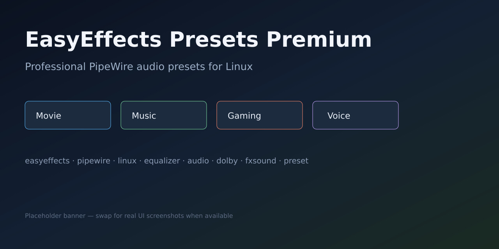
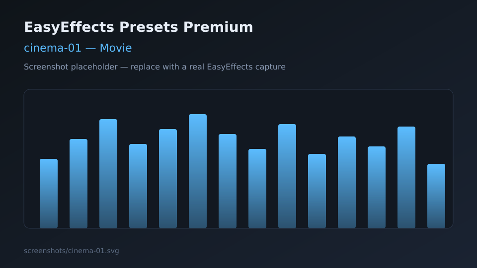
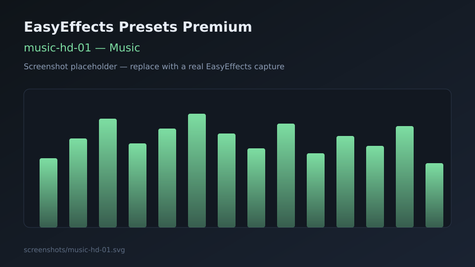
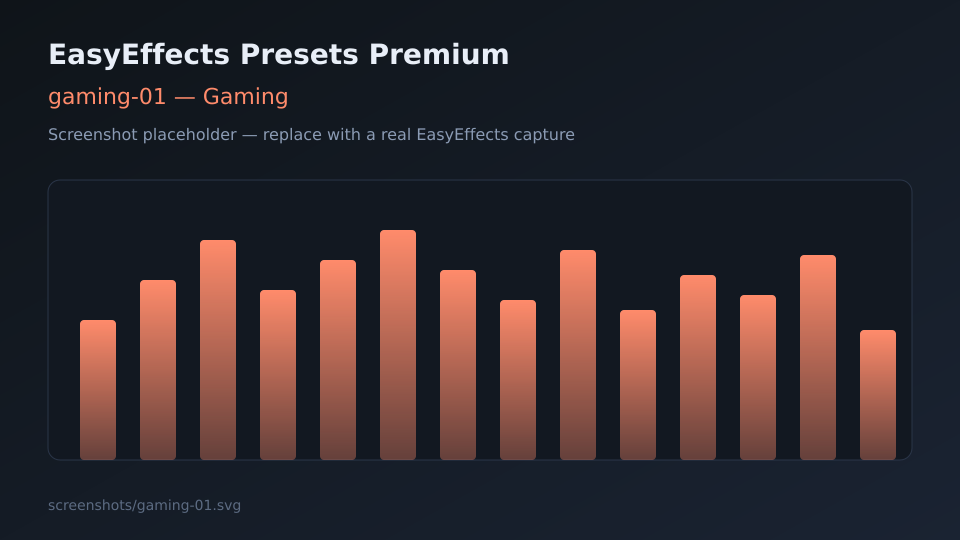
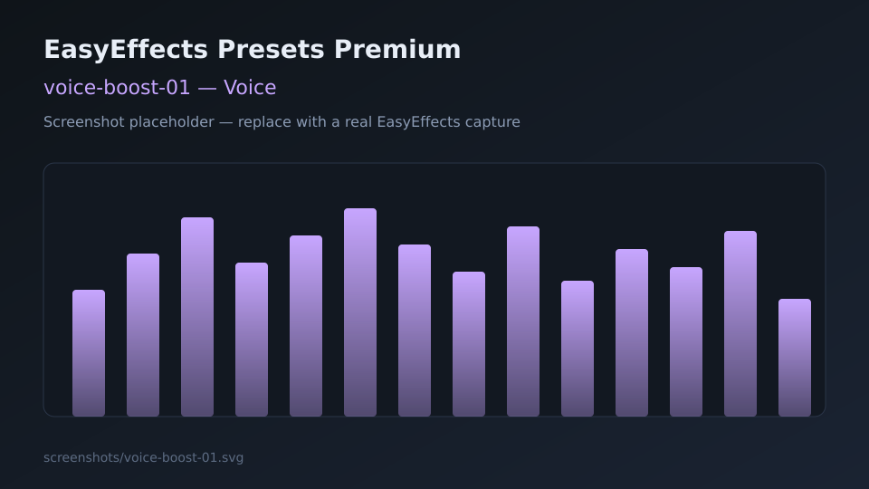
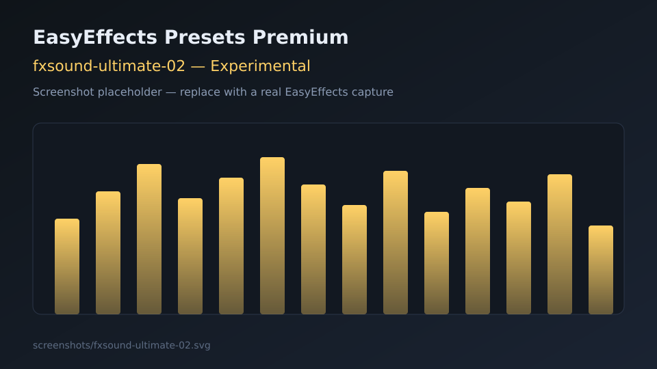

# EasyEffects Presets Premium

[](LICENSE)
[](https://github.com/edevsiv/easyeffects-presets/stargazers)
[](https://github.com/edevsiv/easyeffects-presets/releases)
[](https://github.com/edevsiv/easyeffects-presets/issues)
[](https://github.com/edevsiv/easyeffects-presets/pulls)
[](https://github.com/edevsiv/easyeffects-presets)
[](https://github.com/wwmm/easyeffects)
[](https://pipewire.org/)
[](https://github.com/edevsiv/easyeffects-presets/actions/workflows/validate-json.yml)

Curated, categorized **EasyEffects** output presets for **PipeWire** on Linux — cinema, music, gaming, voice, and experimental enhancer-style chains.



## Description

**EasyEffects Presets Premium** is an open-source collection of ready-to-import JSON presets for [EasyEffects](https://github.com/wwmm/easyeffects). The goal is a clean, documented, scalable repository that feels like a mature Linux-audio project: clear categories, install scripts, CI validation, and guides for PipeWire and MPV.

Whether you want clearer film dialogue, punchier games, or an FxSound-like listening mode after moving from Windows, pick a category and import.

## Objectives

- Ship **production-ready** EasyEffects presets with consistent naming
- Document **install paths** for APT and Flatpak
- Explain **PipeWire** latency / quantum trade-offs
- Help with **MPV** stereo downmix for 5.1 cinema
- Stay easy to **contribute** to (templates, validation, CoC)

## Screenshots

Placeholders until real EasyEffects UI captures are added:

| Category | Preview |
|----------|---------|
| Overview |  |
| Movie |  |
| Music |  |
| Gaming |  |
| Voice |  |
| Experimental |  |

Full catalog: [presets/README.md](presets/README.md)

## Features

- **11** output presets across **5** categories
- Kebab-case filenames and documented plugin chains
- One-command installer (`scripts/install.sh`)
- JSON + structure validation (`scripts/validate.sh`)
- GitHub Actions CI
- Guides for EasyEffects, PipeWire, and MPV
- MIT licensed

## Quick install

```bash
git clone https://github.com/edevsiv/easyeffects-presets.git
cd easyeffects-presets
chmod +x scripts/install.sh
./scripts/install.sh
```

Then open EasyEffects → **Presets** and select one of the imported profiles.

Dry-run / force path:

```bash
./scripts/install.sh --dry-run
./scripts/install.sh --flatpak
./scripts/install.sh --native
```

## Importing presets (manual)

1. Install EasyEffects (see [docs/INSTALL.md](docs/INSTALL.md))
2. Copy JSON files into the output presets directory:

| Install method | Typical path |
|----------------|--------------|
| Native (newer) | `~/.local/share/easyeffects/output/` |
| Native (older) | `~/.config/easyeffects/output/` |
| Flatpak | `~/.var/app/com.github.wwmm.easyeffects/config/easyeffects/output/` |

3. Or use **Import Preset** in the EasyEffects UI

```bash
mkdir -p ~/.local/share/easyeffects/output
cp presets/*/*.json ~/.local/share/easyeffects/output/
```

## Project structure

```text
easyeffects-presets/
├── .github/
│   ├── ISSUE_TEMPLATE/
│   ├── PULL_REQUEST_TEMPLATE.md
│   └── workflows/validate-json.yml
├── docs/
│   ├── INSTALL.md
│   ├── PIPEWIRE.md
│   └── MPV.md
├── mpv/                 # example mpv.conf
├── pipewire/            # example quantum config
├── presets/
│   ├── movie/
│   ├── music/
│   ├── gaming/
│   ├── voice/
│   └── experimental/
├── screenshots/         # SVG placeholders (+ future PNGs)
├── scripts/
│   ├── install.sh
│   ├── validate.sh
│   └── check_markdown_links.py
├── CHANGELOG.md
├── CODE_OF_CONDUCT.md
├── CONTRIBUTING.md
├── LICENSE
├── README.md
└── SECURITY.md
```

## Requirements

- Linux with working audio
- **PipeWire** (+ WirePlumber recommended)
- **EasyEffects** 7.x or newer preferred
- LV2 plugins commonly used by EasyEffects (Equalizer, compressor, limiter, …)

## Required plugins

Most EasyEffects packages pull these in. If a preset fails to load a module, install distribution packages such as:

| Plugin family | Used for |
|---------------|----------|
| LSP / built-in EQ | Equalizer |
| EasyEffects built-ins | Bass Enhancer, Exciter, Stereo Tools, Autogain, Gate, De-esser |
| Multiband compressor | `*-02` cinematic / enhancer chains |
| Limiter / Maximizer | Peak protection |

Exact package names: `lsp-plugins`, `calf-plugins`, `zam-plugins` (distro-dependent). See [docs/INSTALL.md](docs/INSTALL.md).

## PipeWire

EasyEffects is a PipeWire filter client. Buffer (**quantum**), sample rate, and CPU headroom decide whether heavy presets crackle.

- Guide: [docs/PIPEWIRE.md](docs/PIPEWIRE.md)
- Example config: [pipewire/99-quantum-example.conf](pipewire/99-quantum-example.conf)

Starting point for desktop use: **48 kHz**, quantum **1024**.

## EasyEffects

- Project: https://github.com/wwmm/easyeffects
- Community presets wiki: https://github.com/wwmm/easyeffects/wiki/Community-Presets
- Enable the application you want to process (or process all outputs)
- Prefer a **limiter** at the end of loud chains (already included in this pack)

## Compatibility

| Component | Status |
|-----------|--------|
| PipeWire | Supported (recommended) |
| PulseAudio-only | Not targeted (EasyEffects is PipeWire-oriented) |
| EasyEffects 7+ | Primary target |
| EasyEffects Flatpak | Supported via `~/.var/app/...` paths |
| PulseEffects presets | Not supported without conversion |
| HDMI bitstream passthrough | Bypass EasyEffects (need PCM decode) |

## Preset overview

| Preset | Category | Use when… |
|--------|----------|-----------|
| `cinema-01` / `cinema-02` | movie | Films & series |
| `music-hd-01` / `music-hd-02` / `classic-music-01` | music | Music listening |
| `gaming-01` / `gaming-02` | gaming | Games |
| `voice-boost-01` / `voice-boost-02` | voice | Speech-heavy content |
| `volume-booster-01` / `fxsound-ultimate-02` | experimental | Loudness / enhancer fun |

Details and plugin lists: [presets/README.md](presets/README.md)

## FAQ

**Does this replace EasyEffects?**  
No. This repository only provides presets and docs.

**Can I use these with headphones and speakers?**  
Yes. Start with `*-01` profiles; tune EQ to your device.

**Why do some `*-02` presets look similar?**  
They share a fuller “premium” processing stack (autogain, multiband, exciter, …) with category-specific tuning in the JSON parameters.

**Is Flatpak supported?**  
Yes. Use `./scripts/install.sh --flatpak` or copy into the Flatpak config tree.

**Will this work on Steam Deck / immutable distros?**  
Yes if EasyEffects runs (often via Flatpak).

## Troubleshooting

| Problem | What to try |
|---------|-------------|
| Preset missing after copy | Wrong directory (Flatpak vs native); restart EasyEffects |
| No audible change | App not processed; wrong output device; bypass enabled |
| Crackling | Raise PipeWire quantum; use lighter `*-01` preset |
| Clipping / harshness | Lower Autogain / Bass Enhancer; rely on Limiter |
| Plugin missing | Install LSP/Calf/Zam packages; update EasyEffects |
| mpv + cinema sounds wrong | Avoid double loudness (see [docs/MPV.md](docs/MPV.md)) |

More: [docs/INSTALL.md](docs/INSTALL.md), [docs/PIPEWIRE.md](docs/PIPEWIRE.md)

## Roadmap

- [ ] Real UI screenshots per preset
- [ ] Input (microphone) preset pack
- [ ] Autoload examples per application
- [ ] AUR / packaging helpers
- [ ] More device-specific EQ targets (laptop speakers, IEMs)
- [ ] Optional IRS / convolver demos

Track progress in [CHANGELOG.md](CHANGELOG.md) and GitHub Issues.

## Credits

- [EasyEffects](https://github.com/wwmm/easyeffects) by Wellington Wallace and contributors
- [PipeWire](https://pipewire.org/) project
- Community preset authors listed on the [EasyEffects wiki](https://github.com/wwmm/easyeffects/wiki/Community-Presets)
- Inspiration from commercial enhancers such as FxSound (this project is unaffiliated)

## License

Distributed under the [MIT License](LICENSE).

## Contributing

Read [CONTRIBUTING.md](CONTRIBUTING.md) and follow the [Code of Conduct](CODE_OF_CONDUCT.md).

```bash
./scripts/validate.sh
```

Security reports: [SECURITY.md](SECURITY.md)

---

### Topics (discovery / SEO)

`easyeffects` · `pipewire` · `linux` · `equalizer` · `audio` · `dolby` · `fxsound` · `preset` · `linux-audio` · `audio-processing`

Suggested GitHub repository topics:

```text
easyeffects pipewire linux equalizer audio dolby fxsound preset linux-audio audio-processing
```
