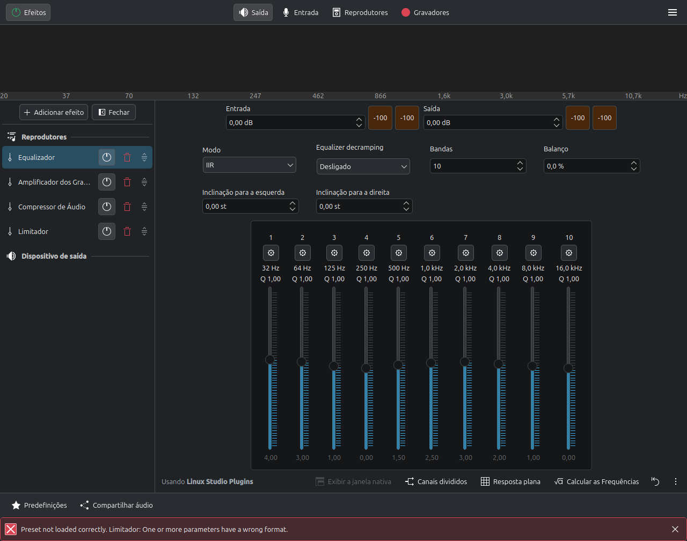
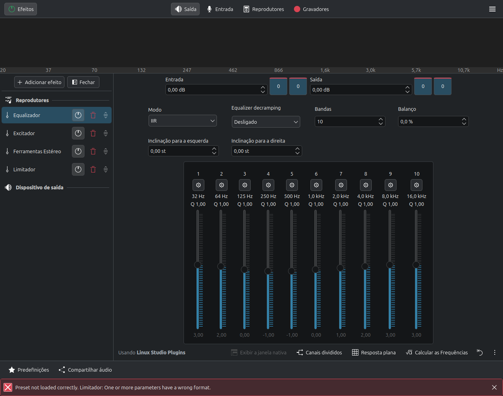
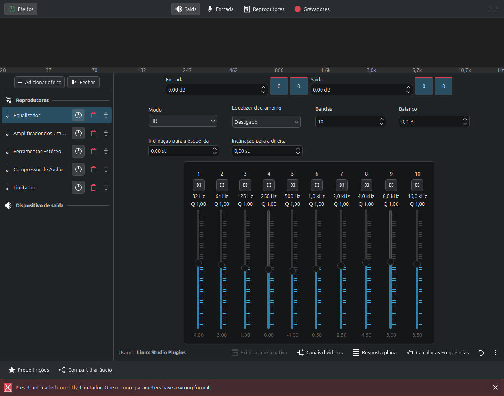

# EasyEffects Audio Platform

[](LICENSE)
[](https://github.com/edevsiv/easyeffects-presets/releases)
[](https://github.com/edevsiv/easyeffects-presets/actions/workflows/validate-json.yml)
[](https://github.com/edevsiv/easyeffects-presets)
[](https://github.com/wwmm/easyeffects)
[](https://pipewire.org/)

Open **Linux audio engineering & calibration platform** for [EasyEffects](https://github.com/wwmm/easyeffects) + [PipeWire](https://pipewire.org/). Curated output profiles, hardware guidance, DSP knowledge, and a certification lab.

**Current release:** [v1.0.0](https://github.com/edevsiv/easyeffects-presets/releases/tag/v1.0.0) — **9 Stable** · 1 Beta · 1 Experimental



---

## Quick Start

```bash
git clone https://github.com/edevsiv/easyeffects-presets.git
cd easyeffects-presets
chmod +x scripts/install.sh
./scripts/install.sh          # auto-detect Flatpak vs native
```

Open EasyEffects → **Presets** → select a profile (start with `*-01`).

```bash
./scripts/install.sh --flatpak
./scripts/install.sh --native
./scripts/install.sh --dry-run
```

Requirements: Linux + PipeWire + EasyEffects 7+ (8.x recommended). Details: [docs/INSTALL.md](docs/INSTALL.md).

---

## Downloads

| Asset | Link |
|-------|------|
| **GitHub Release v1.0.0** | https://github.com/edevsiv/easyeffects-presets/releases/tag/v1.0.0 |
| Presets ZIP | `easyeffects-presets-v1.0.0-presets.zip` on the release page |
| Release notes | [release/NOTES_v1.0.0.md](release/NOTES_v1.0.0.md) |
| Changelog | [CHANGELOG.md](CHANGELOG.md) |

Manual import: copy JSON from `presets/<category>/` into the EasyEffects output folder, or use **Import Preset** in the UI.

| Install | Typical path |
|---------|--------------|
| Flatpak (EE8) | `~/.var/app/com.github.wwmm.easyeffects/data/easyeffects/output/` |
| Native (EE8) | `~/.local/share/easyeffects/output/` |

---

## Profiles

| Preset | Category | Seal | Use when… |
|--------|----------|------|-----------|
| `cinema-01` / `cinema-02` | movie | **Stable** | Films & series |
| `music-hd-01` / `music-hd-02` / `classic-music-01` | music | **Stable** | Music listening |
| `gaming-01` / `gaming-02` | gaming | **Stable** | Games |
| `voice-boost-01` / `voice-boost-02` | voice | **Stable** | Speech-heavy content |
| `volume-booster-01` | experimental | **Beta** | Loudness tool |
| `fxsound-ultimate-02` | experimental | **Experimental** | Enhancer showcase |

Prefer `*-01` for lighter CPU and lower fatigue. Cards + index: [platform/audio-profiles/](platform/audio-profiles/) · [profiles.json](platform/database/profiles.json). Seals: [validation/STATUS.md](validation/STATUS.md).

  

---

## Hardware

Start from your device class, not a random preset:

| Resource | Path |
|----------|------|
| Recommend by hardware | [platform/tools/recommend-by-hardware.md](platform/tools/recommend-by-hardware.md) |
| Hardware taxonomy | [platform/hardware/](platform/hardware/) |
| Calibration playbooks | [calibration/](calibration/) |
| Reference device | [HW-001 Acer Nitro AN515-51](validation/hardware/HW-001-acer-nitro-an515-51.md) (Realtek ALC255) |

**Reference environment:** Linux Mint 22.3 · PipeWire 1.0.5 · EasyEffects Flatpak 8.2.8.

Distro install notes (Ubuntu / Mint / Fedora / Arch): [release/DISTRO_INSTALL_v1.0.0.md](release/DISTRO_INSTALL_v1.0.0.md).

---

## FAQ

**Does this replace EasyEffects?**  
No — presets, docs, and calibration tools only.

**Headphones and speakers?**  
Yes. Start with Stable `*-01` profiles; tune EQ to your device.

**Flatpak?**  
Yes. `./scripts/install.sh --flatpak` writes to the EE8 data path.

**Steam Deck / immutable distros?**  
Yes if EasyEffects runs (usually Flatpak).

**Why are some presets not Stable?**  
`volume-booster-01` missed listening gates (Beta). `fxsound-ultimate-02` fails fatigue criteria (Experimental).

**Crackling or harshness?**  
Raise PipeWire quantum; try a lighter `*-01`; rely on the limiter. See [docs/PIPEWIRE.md](docs/PIPEWIRE.md).

---

## Platform hub

| Enter here | Path |
|------------|------|
| Platform | [platform/](platform/) |
| DSP knowledge | [platform/dsp/](platform/dsp/) |
| Certification | [validation/CERTIFICATION.md](validation/CERTIFICATION.md) |
| Listening campaign | [VC-2026-08-LISTEN](validation/campaigns/VC-2026-08-LISTEN/) |
| Research / matrix | [research/](research/) · [FEATURE_MATRIX.md](research/FEATURE_MATRIX.md) |
| AutoEQ / IR | [autoeq/](autoeq/) · [impulse-responses/](impulse-responses/) |
| Roadmap | [AUDIO_ROADMAP.md](AUDIO_ROADMAP.md) |
| Post-release | [release/POST_RELEASE.md](release/POST_RELEASE.md) |

Promotion path: `Experimental → Beta → Validated → Stable → Reference` — evidence only ([CERTIFICATION](validation/CERTIFICATION.md)).

## Troubleshooting

| Problem | What to try |
|---------|-------------|
| Preset missing | Wrong Flatpak vs native path; restart EasyEffects |
| No audible change | App not processed; bypass on; wrong device |
| Crackling | Higher quantum; lighter preset |
| Clipping | Lower enhancer/autogain; trust limiter |
| Plugin missing | Install LSP/Calf/Zam; update EasyEffects |

## Contributing & license

[CONTRIBUTING.md](CONTRIBUTING.md) · [Code of Conduct](CODE_OF_CONDUCT.md) · [SECURITY.md](SECURITY.md) · [MIT License](LICENSE)

```bash
./scripts/validate.sh
python3 scripts/check_markdown_links.py
```

### Topics (GitHub)

```text
easyeffects pipewire linux equalizer audio dolby fxsound preset linux-audio audio-processing
```
