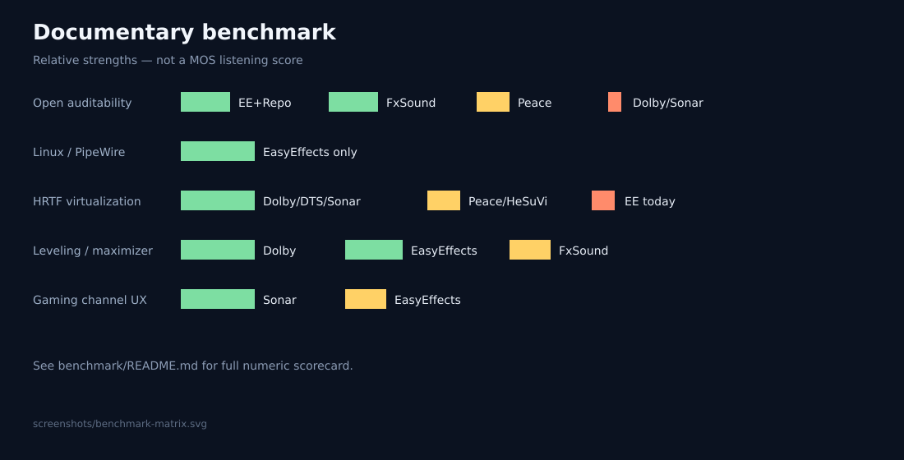

# Official benchmark

Comparative **feature & methodology** benchmark between commercial suites and this project’s EasyEffects approach.

> This is a documentary / capability benchmark, not a double-blind MOS study. Formal listening scores belong in `measurements/` logs.

## Capability scorecard

Scoring: **3** = excellent native support · **2** = good / partial · **1** = weak · **0** = absent

| Capability | FxSound | Dolby PC | SteelSeries Sonar | Peace+APO | EasyEffects (this project) |
|------------|:-------:|:--------:|:-----------------:|:---------:|:--------------------------:|
| Equalizer depth | 2 | 2 | 3 | 3 | 3 |
| Bass enhancement | 3 | 2 | 2 | 2 | 3 |
| Stereo / width | 3 | 3 | 2 | 2 | 2 |
| True HRTF virtualization | 1 | 3 | 3 | 2 | 1–2* |
| Dynamic compression | 3 | 3 | 2 | 2 | 3 |
| Limiter / maximizer | 2 | 3 | 2 | 2 | 3 |
| Automatic gain / leveling | 2 | 3 | 2 | 1 | 3 |
| Loudness compensation | 1 | 3 | 1 | 1 | 2 |
| Exciter / clarity FX | 3 | 1 | 1 | 2 | 3 |
| Per-app routing UX | 1 | 1 | 3 | 1 | 2 |
| Open auditability | 3 | 0 | 0 | 2 | 3 |
| Linux PipeWire support | 0 | 0 | 0 | 0 | 3 |
| Reproducible presets as code | 2 | 0 | 1 | 2 | 3 |

\* Improves as `impulse-responses/` + Convolver presets mature.

## Interpretation

- **FxSound** wins approachability and “enhancer character”.
- **Dolby** wins psychoacoustic leveling + virtualization depth (closed).
- **Sonar** wins gaming workflow / channel mix.
- **Peace** wins correction ecosystems on Windows.
- **EasyEffects + this repo** wins openness, Linux-native graph integration, and documented engineering.

## Our competitive claim

We do not claim identical sound to Dolby/DTS/FxSound.  
We claim the **best open, documented, PipeWire-native preset laboratory** with explicit mappings and test discipline.

## Visual

