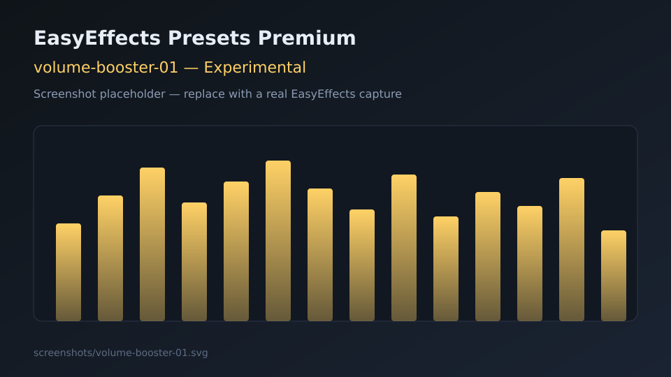

# Experimental presets

Loudness and enhancer-inspired profiles. Use carefully — start at lower system volume.

---

## volume-booster-01

| Field | Detail |
|-------|--------|
| **Name** | `volume-booster-01` |
| **File** | [volume-booster-01.json](volume-booster-01.json) |
| **Description** | Simple loudness-oriented EQ + compressor + limiter chain. |
| **Objective** | Raise perceived volume on quiet devices without unconstrained clipping. |
| **Plugins** | Equalizer, Compressor, Limiter |
| **Use case** | Laptop speakers, quiet headphone amps, late-night low-volume listening. |
| **Screenshot** |  |

---

## fxsound-ultimate-02

| Field | Detail |
|-------|--------|
| **Name** | `fxsound-ultimate-02` |
| **File** | [fxsound-ultimate-02.json](fxsound-ultimate-02.json) |
| **Description** | FxSound-inspired “ultimate” style chain: autogain, multiband, EQ, exciter, bass, stereo width. |
| **Objective** | Approximate commercial Windows enhancer character on Linux via EasyEffects. |
| **Plugins** | Autogain, Multiband Compressor, Equalizer, Exciter, Bass Enhancer, Stereo Tools, Limiter |
| **Use case** | Users migrating from FxSound / similar enhancers; fun / wow-factor listening. |
| **Screenshot** |  |
