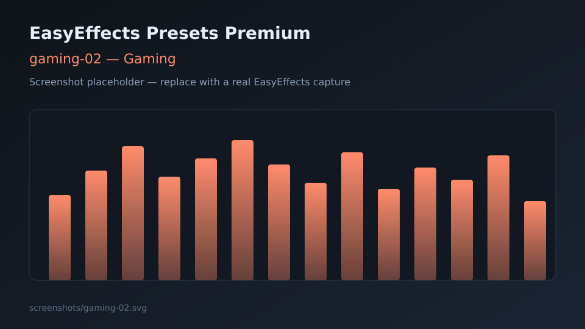

# Gaming presets

Output presets aimed at games: awareness, punch, and immersion.

---

## gaming-01

| Field | Detail |
|-------|--------|
| **Name** | `gaming-01` |
| **File** | [gaming-01.json](gaming-01.json) |
| **Description** | Competitive-leaning EQ with bass control, stereo tools, and dynamics. |
| **Objective** | Improve footsteps and directional cues while keeping explosions controlled. |
| **Plugins** | Equalizer, Bass Enhancer, Stereo Tools, Compressor, Limiter |
| **Use case** | FPS / battle royale on headsets; lower CPU than the full `*-02` chain. |
| **Screenshot** |  |

---

## gaming-02

| Field | Detail |
|-------|--------|
| **Name** | `gaming-02` |
| **File** | [gaming-02.json](gaming-02.json) |
| **Description** | Immersive gaming chain with autogain, multiband compression, and exciters. |
| **Objective** | Dense, exciting presentation for single-player and cinematic games. |
| **Plugins** | Autogain, Multiband Compressor, Equalizer, Exciter, Bass Enhancer, Stereo Tools, Limiter |
| **Use case** | RPGs, adventures, story-driven titles where immersion beats minimal latency. |
| **Screenshot** |  |
