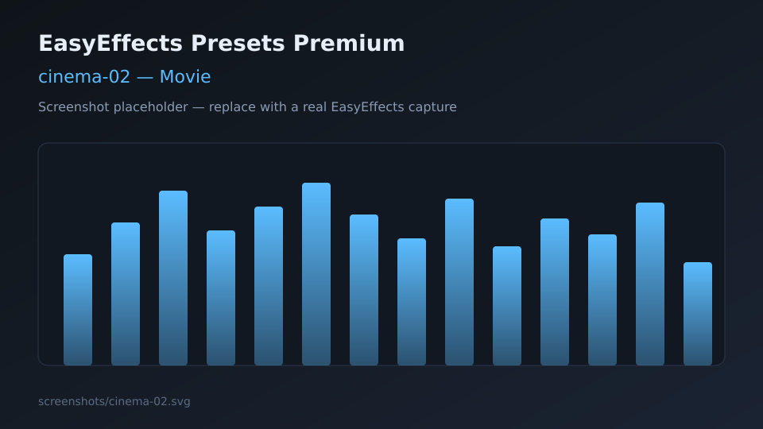

# Movie presets

Output presets tuned for films, series, and cinematic content.

---

## cinema-01

| Field | Detail |
|-------|--------|
| **Name** | `cinema-01` |
| **File** | [cinema-01.json](cinema-01.json) |
| **Description** | Balanced cinematic profile with EQ shaping, bass enhancement, compression, and a safety limiter. |
| **Objective** | Improve dialogue presence and low-end weight without a heavy multiband stack. |
| **Plugins** | Equalizer, Bass Enhancer, Compressor, Limiter |
| **Use case** | Everyday movies/series on headphones or PC speakers; good default cinema preset. |
| **Screenshot** |  |

---

## cinema-02

| Field | Detail |
|-------|--------|
| **Name** | `cinema-02` |
| **File** | [cinema-02.json](cinema-02.json) |
| **Description** | Extended cinematic chain with autogain, multiband compression, exciter, bass enhancer, and stereo tools. |
| **Objective** | Immersive “theater-like” presentation with louder, denser dynamics. |
| **Plugins** | Autogain, Multiband Compressor, Equalizer, Exciter, Bass Enhancer, Stereo Tools, Limiter |
| **Use case** | Action films, streaming at night, systems that need stronger leveling. |
| **Screenshot** |  |

---

See also: [../../docs/MPV.md](../../docs/MPV.md)
