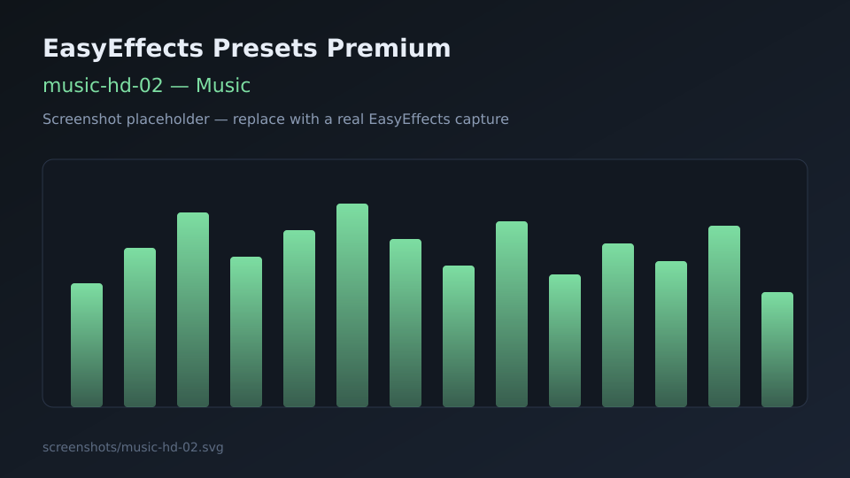
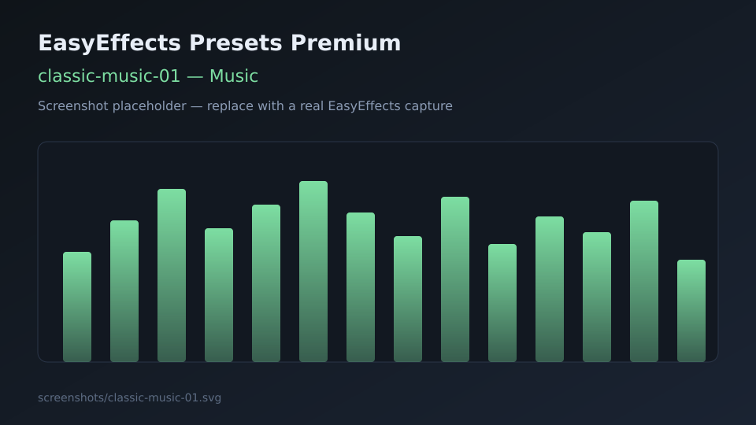

# Music presets

Output presets for stereo music listening.

---

## music-hd-01

| Field | Detail |
|-------|--------|
| **Name** | `music-hd-01` |
| **File** | [music-hd-01.json](music-hd-01.json) |
| **Description** | Hi-clarity music chain focusing on EQ, harmonic excitement, and stereo image. |
| **Objective** | Make mixes feel detailed and open without extreme loudness wars processing. |
| **Plugins** | Equalizer, Exciter, Stereo Tools, Limiter |
| **Use case** | Pop, electronic, rock on headphones or nearfields. |
| **Screenshot** |  |

---

## music-hd-02

| Field | Detail |
|-------|--------|
| **Name** | `music-hd-02` |
| **File** | [music-hd-02.json](music-hd-02.json) |
| **Description** | Enhanced music stack with autogain and multiband dynamics plus width/excitement. |
| **Objective** | Louder, more “produced” listening experience closer to commercial enhancers. |
| **Plugins** | Autogain, Multiband Compressor, Equalizer, Exciter, Bass Enhancer, Stereo Tools, Limiter |
| **Use case** | Playlists, background listening, systems that need more glue and punch. |
| **Screenshot** |  |

---

## classic-music-01

| Field | Detail |
|-------|--------|
| **Name** | `classic-music-01` |
| **File** | [classic-music-01.json](classic-music-01.json) |
| **Description** | Gentle EQ with subtle reverb and limiter for acoustic / classical material. |
| **Objective** | Preserve dynamics while adding a touch of space and tonal balance. |
| **Plugins** | Equalizer, Reverb, Limiter |
| **Use case** | Classical, jazz, acoustic sessions, critical-ish listening. |
| **Screenshot** |  |
