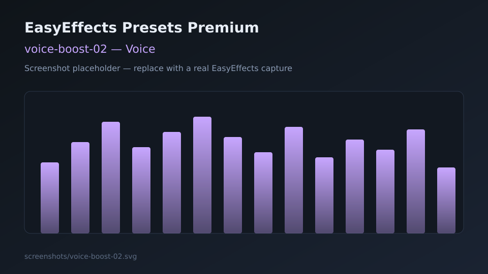

# Voice presets

Output presets that emphasize speech for podcasts, videos, and calls (playback path).

> Note: these are **output** presets (what you hear). For microphone processing, create matching **input** presets in a future release.

---

## voice-boost-01

| Field | Detail |
|-------|--------|
| **Name** | `voice-boost-01` |
| **File** | [voice-boost-01.json](voice-boost-01.json) |
| **Description** | Speech-focused chain with gating, compression, and de-essing. |
| **Objective** | Raise intelligibility of dialogue and spoken-word content. |
| **Plugins** | Equalizer, Gate, Compressor, De-esser, Limiter |
| **Use case** | YouTube essays, podcasts, online classes, quiet dialogue in shows. |
| **Screenshot** |  |

---

## voice-boost-02

| Field | Detail |
|-------|--------|
| **Name** | `voice-boost-02` |
| **File** | [voice-boost-02.json](voice-boost-02.json) |
| **Description** | Broader enhancement chain that still targets clearer, louder spoken content. |
| **Objective** | Stronger leveling and presence for mixed spoken + music beds. |
| **Plugins** | Autogain, Multiband Compressor, Equalizer, Exciter, Bass Enhancer, Stereo Tools, Limiter |
| **Use case** | Variety streams, voice-over heavy media, when `voice-boost-01` is not loud enough. |
| **Screenshot** |  |
