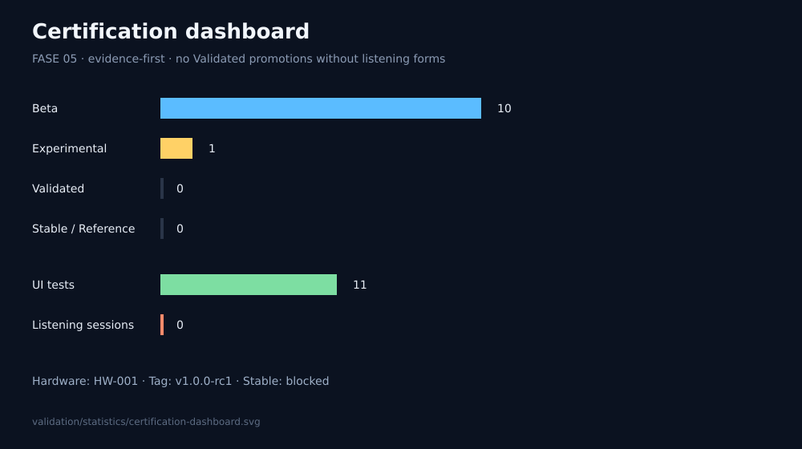

# Certification dashboard

| Metric | Value |
|--------|------:|
| Presets | 11 |
| Hardware IDs | 1 (HW-001) |
| Listeners | 1 (L-001) |
| UI campaign tests (VC-2026-08) | 11 |
| Subjective sessions (VC-2026-08-LISTEN) | **0** |
| Experimental | 1 |
| Beta | 10 |
| Validated | 0 |
| Stable | 0 |
| Reference | 0 |
| Mean ui/design overall | 3.27 |
| Release | `v1.0.0-rc1` (Stable blocked) |

## Seal distribution

See [STATUS.md](STATUS.md) · Profiles: [profiles/](profiles/) · Criteria: [CERTIFICATION.md](CERTIFICATION.md)

## Next actions

1. Fill listening forms under `campaigns/VC-2026-08-LISTEN/sessions/`
2. Re-evaluate gates V1–V6
3. Promote eligible presets Beta → Validated
4. Cut `v1.0.0` Stable only after Stable gates
